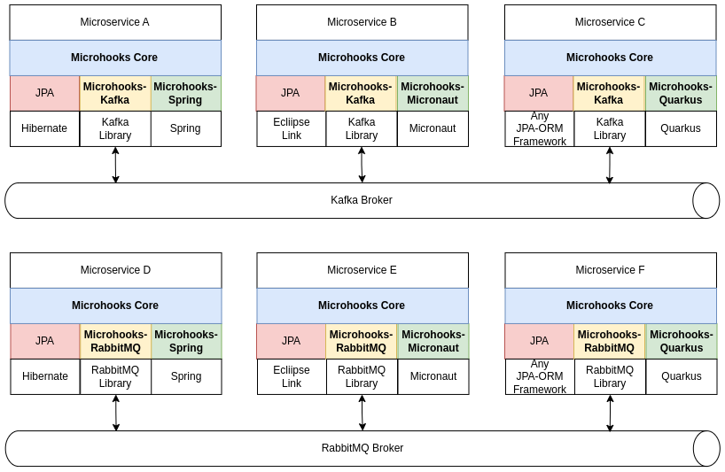
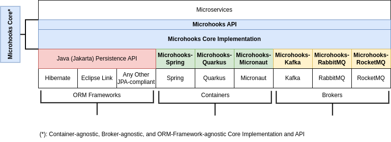
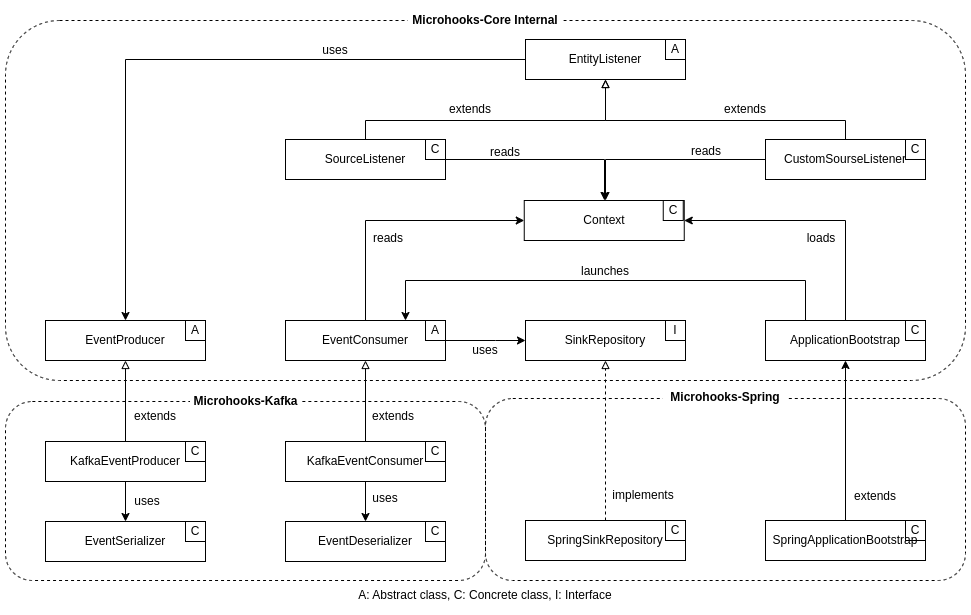
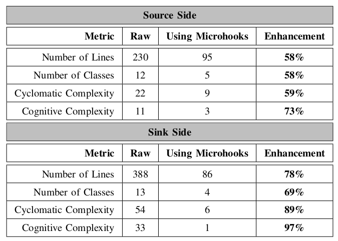

# Microhooks Overview
The microservices architectural model has gained widespread adoption in recent years thanks to its ability to deliver high scalability and maintainability. However, the development process of microservices-based applications can be complex and challenging. Indeed, it often requires developers to manage a large number of distributed components with the burden of handling low-level, recurring needs, such as inter-service communication, brokering, event management, and data replication.

Microhooks is a novel framework designed to streamline the development of microservices by allowing developers to focus on their business logic while declaratively expressing the so-called low-level needs. Based on the inversion of control and the materialized view patterns among others, our framework automatically generates and injects the corresponding artifacts, leveraging 100% build time code introspection and instrumentation, as well as context building, for optimized runtime performance. We provided the first implementation for the Java world, supporting the most popular containers and brokers, and adhering to the standard Java/Jakarta Persistence API. From the user perspective, Microhooks exposes an intuitive, container-agnostic, broker-neutral, and ORM framework-independent API.

Microhooks evaluation against state-of-the-art practices has demonstrated its effectiveness in drastically reducing code size and complexity, without incurring any considerable cost on performance. Based on such promising results, we believe that Microhooks has the potential to become an essential component of the microservices development ecosystem.

# Microhooks Sample Deployment Scenarios

     

# Microhooks Architecture

    

# Microhooks Class Diagram

    

# Microhooks Code Enhancement

    

